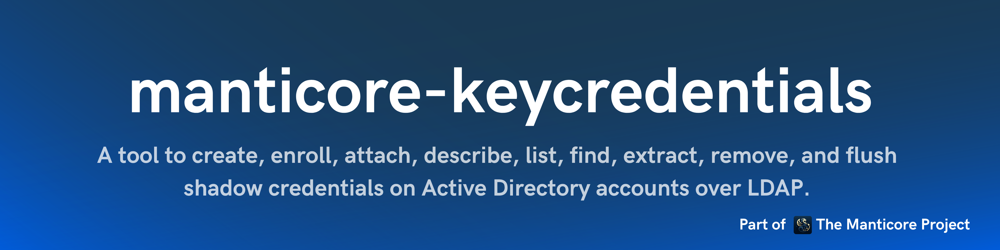

<p align="center">
      A tool to create, enroll, attach, describe, list, find, extract, remove, and flush shadow credentials (msDS-KeyCredentialLink entries, their RSA key material, and device IDs) on Active Directory accounts over LDAP.
      <br>
      <a href="https://github.com/TheManticoreProject/manticore-keycredentials/actions/workflows/release.yaml" title="Build"></a>
      
      
      <a href="https://twitter.com/intent/follow?screen_name=podalirius_" title="Follow"></a>
      <a href="https://www.youtube.com/c/Podalirius_?sub_confirmation=1" title="Subscribe"></a>
      <br>
</p>

## Features

- [x] Create a certificate locally, saving its private key and certificate without touching Active Directory (`create`)
- [x] Create a certificate and attach it to one or more target objects as a key credential (`enroll`)
- [x] Attach an existing certificate, from a PFX or a PEM, to one or more target objects (`attach`)
- [x] Decode and display the key credentials of an object — key id, hash and its integrity, usage, source, device id, timestamps (`describe`)
- [x] List the raw key credential values across one or more objects, or the whole domain (`list`)
- [x] Find which objects a given certificate, private key or public key is set on (`find`)
- [x] Extract the public key of each certificate set on an object, to PEM or DER (`extract`)
- [x] Remove a specified certificate from one or more objects, matched by public key (`remove`)
- [x] Flush the whole `msDS-KeyCredentialLink` attribute of an object (`flush`)
- [x] Authenticate with a password (`-p`), a NT hash (`-H`), or an AES key (`--aes-key`), over LDAP or LDAPS (`-L`), with Kerberos (`-k`) or NTLM
- [ ] Authenticate with a keytab

## Installation

To get this tool you can either download the latest release from the [GitHub release page](https://github.com/TheManticoreProject/manticore-keycredentials/releases) or install it with the following `go` command:

```bash
go install github.com/TheManticoreProject/manticore-keycredentials@latest
```

## Usage

The first positional argument of the program is the mode. Running the tool with
no mode prints the list of available modes:

```
$ ./manticore-keycredentials
manticore-keycredentials - by Remi GASCOU (Podalirius) @ TheManticoreProject - v1.1.0

Usage: manticore-keycredentials <attach|create|describe|enroll|extract|find|flush|list|remove>

   attach    Attach an existing certificate to one or more target objects.
   create    Create a new certificate and save it locally (private key and certificate).
   describe  Display information about the KeyCredentialLink values of a target object.
   enroll    Create and attach a new certificate to one or more target objects.
   extract   Extract the public key of a certificate set on a target object.
   find      Find the objects configured with a given certificate or public key.
   flush     Flush the msDS-KeyCredentialLink attribute of a target object.
   list      List the raw msDS-KeyCredentialLink values of one or more target objects.
   remove    Remove a single specified certificate from one or more target objects.
```

Every mode that talks to the directory shares the same `Configuration`,
`LDAP Connection Settings`, `Authentication` and `Secret` groups. Exactly one of
the `Secret` options (`-p`, `-H`, `--aes-key`, `--ticket-ccache` or
`--ticket-kirbi`) has to be given. `--no-pass` is not a secret of its own: it
states that no password is coming and is passed alongside a ticket:

```
$ ./manticore-keycredentials describe -h
manticore-keycredentials - by Remi GASCOU (Podalirius) @ TheManticoreProject - v1.1.0

Usage: manticore-keycredentials describe --distinguished-name <string> [--domain <string>] [--username <string>] [--no-pass] [--debug] [--dc-ip <string>] [--dc-host <string>] [--ldap-port <tcp port>] [--use-ldaps] [--use-kerberos] [--dns-name-server <string>] [--password <string>] [--hashes <string>] [--aes-key <string>] [--ticket-ccache <string>] [--ticket-kirbi <string>]

  -D, --distinguished-name <string> Distinguished name of the target account.

  Authentication:
    -d, --domain <string>   Active Directory domain to authenticate to. (default: "")
    -u, --username <string> User to authenticate as. (default: "")
    --no-pass               Don't ask for password, the secret is a Kerberos ticket (--ticket-ccache or --ticket-kirbi). (default: false)

  Configuration:
    --debug         Debug mode. (default: false)

  LDAP Connection Settings:
    -dc, --dc-ip <string>       IP Address of the domain controller or KDC (Key Distribution Center) for Kerberos. If omitted, it will use the domain part (FQDN) specified in the identity parameter. (default: "")
    --dc-host <string>          FQDN of the domain controller, used to build the Kerberos SPN when connecting by IP with -k. (default: "")
    -lp, --ldap-port <tcp port> Port number to connect to LDAP server. (default: 389)
    -L, --use-ldaps             Use LDAPS instead of LDAP. (default: false)
    -k, --use-kerberos          Use Kerberos instead of NTLM. (default: false)
    --dns-name-server <string>  DNS name server to use. (default: "")

  Secret:
    -p, --password <string>   Password to authenticate with. (default: "")
    -H, --hashes <string>     NT/LM hashes, format is LMhash:NThash. (default: "")
    --aes-key <string>        AES key to use for Kerberos Authentication (128 or 256 bits). (default: "")
    --ticket-ccache <string>  Path to a Kerberos credential cache (ccache) holding a TGT for pass-the-ticket (implies -k). (default: "")
    --ticket-kirbi <string>   Path to a .kirbi file holding a TGT for pass-the-ticket (implies -k). (default: "")
```

Omitting `-lp/--ldap-port` selects `389` for LDAP and `636` when `-L/--use-ldaps`
is set. An `--aes-key`, `--ticket-ccache` or `--ticket-kirbi` implies Kerberos, so
`-k` does not have to be given with any of them.

To pass the ticket, point `--ticket-ccache` at a Kerberos credential cache (FILE
format) or `--ticket-kirbi` at a `.kirbi` (DER `KRB-CRED`) file holding a TGT. The
principal is read from the ticket, so `-u/--username` is not required:

```
$ ./manticore-keycredentials list -L -dc 192.168.1.10 --dc-host dc1.corp.local -d CORP.local --ticket-ccache ./operator.ccache
```

With Kerberos (`-k`), the service ticket is requested for `ldap/<host>`, and Active
Directory only registers that SPN under the DC's FQDN. When connecting to the DC by
IP, give the FQDN with `--dc-host` so the SPN is correct while the connection and
the KDC exchanges still use the IP:

```
$ ./manticore-keycredentials list -L -k -dc 192.168.1.10 --dc-host dc1.corp.local -d CORP.local -u operator -p 'Passw0rd!'
```

### Certificates: create, enroll, attach

Three modes deal in certificates, split by where the key comes from:

- `create` generates one and writes its private key, certificate and a PFX to disk.
  It does **not** contact Active Directory.
- `enroll` generates one *and* attaches it to the target objects as a key
  credential, so it takes the LDAP, authentication, target and safety flags and a
  `KeyCredential` group for the fields of the credential. Each object gets its own
  certificate, whose subject is that object's `sAMAccountName`, and its own exported
  key.
- `attach` takes a certificate the caller already holds — a PFX (`--pfx`, with
  `--pfx-password`) or a PEM (`--pem`) — and attaches that same certificate to every
  target. Only the public key is needed, so a certificate, a private key or a public
  key are all usable PEM inputs.

```
$ ./manticore-keycredentials enroll -h
...
  Export certificate:
    --export-pem    Export the certificate in PEM format. Can be combined with --export-pfx. (default: false)
    --export-pfx    Export the certificate in PFX format. Can be combined with --export-pem. (default: false)

  KeyCredential:
    --identifier <string>      Identifier of the KeyCredential. A fresh one is generated per object when omitted. (default: "")
    --creation-time <string>   Creation time of the KeyCredential. (default: "")
    --last-logon-time <string> Last logon time of the KeyCredential. (default: "")
    --not-before-time <string> Not before time of the certificate. (default: "")
    --not-after-time <string>  Not after time of the certificate. (default: "")
    --key-size <int>           Key size of the certificate. (default: 2048)
    --device-id <string>       Device ID of the KeyCredential. A fresh one is generated per object when omitted. (default: "")
```

Because `create` no longer touches the directory, the Active Directory flags it
used to accept are rejected with a pointer to `enroll`, rather than being silently
ignored:

```
$ ./manticore-keycredentials create -D 'CN=PC01,CN=Computers,DC=MANTICORE,DC=local' -dc 192.168.1.10 -u operator -p 'Passw0rd!'
[error] create no longer writes to Active Directory, it generates a certificate locally; the flag(s) -D, -dc, -u, -p belong to 'enroll', which creates and attaches a credential to a target object
```

### Targets and safety

`enroll`, `attach`, `list` and `remove` act on one or more objects, selected with
the same three flags (there is no repeatable flag, so a set of objects is named by
a filter or a file rather than by repeating `-D`):

- `-D, --distinguished-name` — a single object by its distinguished name.
- `-f, --filter` — every object matching an LDAP filter, e.g. `-f '(objectClass=computer)'`.
- `-tf, --targets-file` — every distinguished name listed in a file, one per line, `#` for comments.

Exactly one selector is required, except for `list`, which lists every object
holding a `msDS-KeyCredentialLink` when none is given.

The write modes (`enroll`, `attach`, `remove`) guard bulk changes:

- Every run prints the objects it resolved, and what it will do to them, before
  touching the directory.
- Acting on more than one object prompts for confirmation; `-y, --yes` skips the
  prompt for unattended use. A closed or non-interactive stdin counts as "no", so
  an unattended run cannot mass-modify by default.

A run reports success or failure per object and, if any object could not be
written, returns an error naming how many of how many failed.

### Finding where a certificate is planted

`find` works the other way round from the read modes: instead of naming an object
and showing its key credentials, it takes a key and reports which objects have it
set. A key credential stores only the public key, so a certificate, a private key
and a public key are all usable inputs — the public key is derived from whichever is
given:

```
$ ./manticore-keycredentials find --pem ./keys/target.cert.pem -d MANTICORE.local -u operator -p 'Passw0rd!' -dc 192.168.1.10
$ ./manticore-keycredentials find --pfx ./keys/target.pfx --pfx-password 'hunter2' -d MANTICORE.local -u operator -p 'Passw0rd!' -dc 192.168.1.10
```

The whole domain is searched by default; pass `-D` to check a single object. This is
the reverse lookup that answers "where else is this credential planted?", and it
pairs with [FindReusedKeyCredentials](https://github.com/TheManticoreProject/FindReusedKeyCredentials),
which finds keys shared between objects without needing the key up front.

## Demonstration

Detecting a **reused key credential**: the same key planted on several objects. This
is the reverse Shadow Credentials problem — a single certificate (legitimate or
malicious) set on more than one principal — and `find` locates every object it was
planted on, even though each object's raw attribute value differs.

### 1. Create one certificate

`create` generates a keypair locally and never touches the directory:

```
$ manticore-keycredentials create --subject shared-key --pfx-password 'hunter2'
[>] Created a new certificate for shared-key:
  ├── Private key (PEM): keys/.../shared-key.pem
  ├── Certificate (PEM): keys/.../shared-key.cert.pem
  └── PFX (password 'hunter2'): keys/.../shared-key_hunter2.pfx
```

### 2. Attach that same certificate to two objects

`attach` sets the caller's certificate on each target. Attaching one certificate to
two objects is the reuse: each object gets its own `KeyID`, `DeviceId`, `KeyHash` and
timestamps, but they share the same key material.

```
$ manticore-keycredentials attach -L -d MANTICORE.local -u operator -p 'Passw0rd!' -dc 192.168.1.10 \
      --pfx keys/.../shared-key_hunter2.pfx --pfx-password 'hunter2' \
      -D 'CN=Administrator,CN=Users,DC=MANTICORE,DC=local'
[>] Attaching the certificate (fingerprint f329b79a7e1c2a2c) to (1):
  └── CN=Administrator,CN=Users,DC=MANTICORE,DC=local
INFO: Attached the certificate to 'CN=Administrator,CN=Users,DC=MANTICORE,DC=local'

$ manticore-keycredentials attach -L -d MANTICORE.local -u operator -p 'Passw0rd!' -dc 192.168.1.10 \
      --pfx keys/.../shared-key_hunter2.pfx --pfx-password 'hunter2' \
      -D 'CN=Guest,CN=Users,DC=MANTICORE,DC=local'
[>] Attaching the certificate (fingerprint f329b79a7e1c2a2c) to (1):
  └── CN=Guest,CN=Users,DC=MANTICORE,DC=local
INFO: Attached the certificate to 'CN=Guest,CN=Users,DC=MANTICORE,DC=local'
```

`list` shows why byte-for-byte comparison misses this. The two values differ at the
front (`KeyID`) and the end (`DeviceId`, timestamps), while the key material in the
middle is identical:

```
$ manticore-keycredentials list -L -d MANTICORE.local -u operator -p 'Passw0rd!' -dc 192.168.1.10
[>] Objects with a msDS-KeyCredentialLink (2):
  ├── CN=Administrator,CN=Users,DC=MANTICORE,DC=local
  │   └── B:828:0002...56A07C4A...0103525341310008...010001E012E84AC23F6B...:CN=Administrator,...
  └── CN=Guest,CN=Users,DC=MANTICORE,DC=local
      └── B:828:0002...CB16F4ED...0103525341310008...010001E012E84AC23F6B...:CN=Guest,...
                        ^^^^^^^^ different KeyID     ^^^^^^^^^^^^^^^^^^^^^^ identical key material
```

`describe` confirms every metadata field a naive comparison keys on is different,
even though the underlying key is the same:

```
$ manticore-keycredentials describe -L -d MANTICORE.local -u operator -p 'Passw0rd!' -dc 192.168.1.10 \
      -D 'CN=Administrator,CN=Users,DC=MANTICORE,DC=local'
[>] KeyCredentialLink values of CN=Administrator,CN=Users,DC=MANTICORE,DC=local (1):
  └── [1] KeyID: VqB8Spcc9TJ73KRt3K3EdwrbXdZPwxnGCiy/9HIbiFo=
      ├── KeyHash: dab147b9...156f (valid)
      ├── DeviceId: d0215aed-0cdf-270d-cd8c-0f94ef5547fc
      └── CreationTime (UTC): 2026-08-03 15:31:24
```

### 3. Find every object the key is set on

`find` fingerprints the key material and reports every object that carries it,
regardless of the surrounding metadata. A certificate, private key or public key are
all usable inputs, so a public certificate is enough:

```
$ manticore-keycredentials find -L -d MANTICORE.local -u operator -p 'Passw0rd!' -dc 192.168.1.10 \
      --pem keys/.../shared-key.cert.pem --debug
DEBUG: Searching for key fingerprint: BCRYPT_RSA_PUBLIC_KEY:0x010001:0xe012e84a...e1bcd25
DEBUG: Compared 2 key credentials, skipped 0
[>] Objects with this key credential (2):
  ├── CN=Administrator,CN=Users,DC=MANTICORE,DC=local
  │   ├── DeviceId: d0215aed-0cdf-270d-cd8c-0f94ef5547fc
  │   └── CreationTime (UTC): 2026-08-03 15:31:24
  └── CN=Guest,CN=Users,DC=MANTICORE,DC=local
      ├── DeviceId: a3fe6514-95fa-2b67-fa78-5f09459b61b2
      └── CreationTime (UTC): 2026-08-03 15:15:07
```

Both objects are reported despite their byte-different attribute values: the match is
on the key, not on the blob. This is the reverse lookup that answers "where else is
this credential planted?", and it pairs with
[FindReusedKeyCredentials](https://github.com/TheManticoreProject/FindReusedKeyCredentials),
which finds keys shared between objects without needing the key up front.

### 4. Clean up

`remove` deletes just the matching credential from an object, leaving any other
credentials in place; `flush` clears the whole `msDS-KeyCredentialLink` attribute of
an object:

```
$ manticore-keycredentials remove -L -d MANTICORE.local -u operator -p 'Passw0rd!' -dc 192.168.1.10 \
      --pfx keys/.../shared-key_hunter2.pfx --pfx-password 'hunter2' \
      -D 'CN=Administrator,CN=Users,DC=MANTICORE,DC=local'
[>] Objects the certificate would be removed from (1 of 1 resolved):
  └── CN=Administrator,CN=Users,DC=MANTICORE,DC=local (1 to remove, 0 kept)
INFO: Removed 1 value(s) from 'CN=Administrator,CN=Users,DC=MANTICORE,DC=local'
```

## Contributing

Pull requests are welcome. Feel free to open an issue if you want to add other features.

## Credits
  - [Remi GASCOU (Podalirius)](https://github.com/p0dalirius) for the creation of the [manticore-keycredentials](https://github.com/TheManticoreProject/manticore-keycredentials) project.
